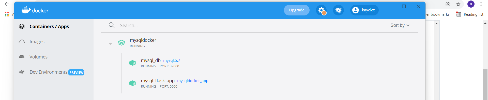
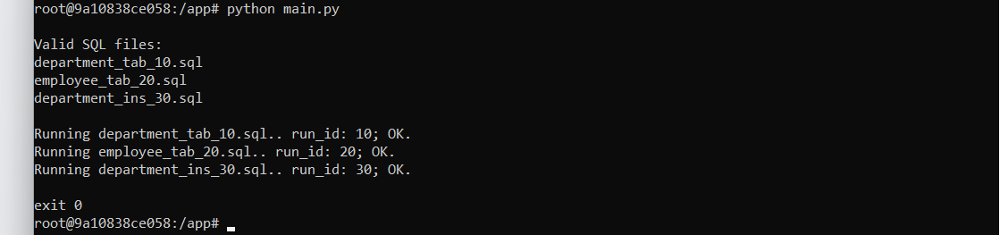
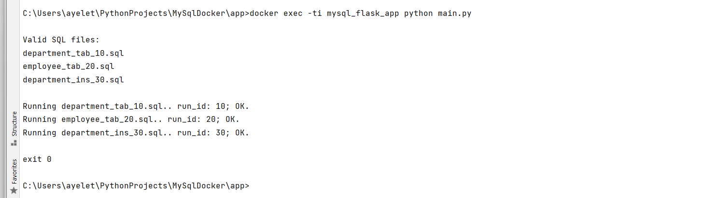
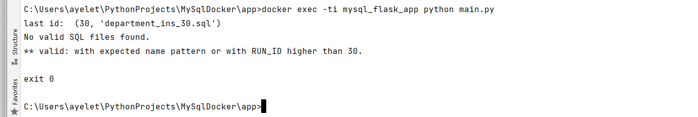
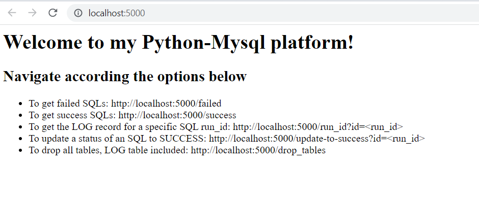

# docker-python-flask
python-flask project based on docker config. The project was created as path of self-learning and practicing Docker principles.
The configuration consists on two containers:
1. Mysql container. Already contains DATABASE mysql_db and SQL log table SQL_RUN_LOG.
2. Applicative python container, also allows to send requests to query/act on the SQLs scripts/tables via the Flask app.

# OS
This docker cluster has been written and run on Windows 10.

# project's structure
app/  
  - main.py: runs SQL files on the MYSQL database   
  - app.py: runs the Flask app  
  - database.py: contains the Database class with properties and methods run by the main.py script  
  - Dockerfile: builds the mysql_flask_app container  
  - requirements: contains list of Python required libraries  
  - templates/  
    - index.html  

db/  
  - init.sql: initializes the mysql_db container by creating database 'mysql_db' and creating SQL_RUN_LOG table.  

sqls/   
  - sql_run_log_0.sql: in case table is dropped, this file creating it will be the first to run by main.py  
  - department_tab_10.sql: example file  
  - employee_tab_20.sql: example file  
  - department_ins_30.sql: example file  

docker-compose.yml: creates the docker cluster with the two containers  
  

# Python-Mysql development Platform
## Purpose
The project provides dev cluster allowing the user to run SQL scripts on the (Mysql) database and develop/test/run against it in Python environment.
The run SQL files are registered in table SQL_RUN_LOG.

### SQL scripts
1. Although the table created already in image, the script for creating log table SQL_RUN_LOG already provided unders sqls: sql_run_log_0.sql
   DO not change the RUN_ID (0) of script, it makes it the first to be run, before any other SQL file.
2. The SQL file names must comply with name convention [a-zA-Z_]+_[0-9]+.sql
   Although table/object name is not encorced, it is recommended to create file names with the name of the object and its type.
   Example: employee_tab_10.sql
3. The number at the end of the file name represents the order in which the files should be run.  
4. This number is referred to as the SQL RUN_ID and written as such in the SQL_RUN_LOG table.
5. Recommendation: create the SQL files with a gap of 10 between consecutive files. For example, department_tab_10.sql, employee_tab_20.sql etc; this
   will allow you flexibility in filling unnoticed data gaps without having to change all scripts names if some scripts were forgotten.
6. The gaps between SQL RUN_ID, though, must not exceed 10. For example, running department_tab_10.sql, employee_tab_21.sql with no SQL script with RUN_ID between 10 and 21,
   will issue an error.
7. Two SQL files cannot have the same RUN_ID. If found, an error will be issued.   

### SQLs run flow
When running Python script main.py, the run flow is as follows:
1. If table SQL_RUN_LOG does not exist, it will be created by running provided script sql_run_log_0.sql
2. A record with SQL file name, its RUN_ID, status (SUCCESS or FAILURE), error (in case of FAILURE) and date are written after the run of each SQL file.
3. The SQL files are run according to the last RUN_ID found in SQL_RUN_LOG table with status SUCCESS.
   example A: if scripts department_tab_10.sql, employee_tab_20.sql and department_tab_10.sql, employee_tab_20.sql passed successfully while 
   employee_ins_30.sql failed, the next time main.py will run, the first SQL file to run with be with the smallest RUN_ID that is greater than 20.
4. The main.py script will exit with error at the first FAILURE. Before exiting, a ROLLBACK will be executed for all file's statements.
   ** Of course, rollback can be applied only for DML statements.

## Setup and run the Docker cluster
(Docker-desktop installtion assumed)
1. clone this repository to you directory path on your OS.
2. go to the local/repository/path
3. run docker-compose up

You should now see the cluster via your docker-desktop

## Flask app container: running SQL scripts
You can either run the program from the container itself or from your local host on your OS.
### Examples
#### from container

#### from terminal

### output when no files with RUN_ID higher than in SQL_RUN_LOG table found in sql files

## Running specific SQL file
Usage: main.py <path to SQL file>  
Note: path must exist in container. If no path specified, the SQL file is expected to be found in container, in /tmp  
Example (when running from terminal): docker -it mysql_flask_app main.py employee_ins_40.sql  

## Running SQL files in a specific directory
Usage: main.py <path to the directory containing the SQL files>  
Note: only SQL files with RUN_IDs higher than registered in SQL_RUN_LOG will run. Also, directory expected to exisr in container.  
Example (when running from terminal): docker -it mysql_flask_app main.py /tmp/new_sqls  
  
## View Database on Mysql Client UI
For a better view of your DB tables and run status in SQL_RUN_LOG table, configure DB on one of the Mysql available UIs.
Example, MySql Workbench (user: root, 
  
  

The Flask app end-points allow to perform some requests or apply actions as described in the home Flask URL once the Docker cluster is up, see below:

   

## How to run the program
* From container (from /app): python main.py  
* From terminal: docker exec -ti mysql_flask_app python main.py  
* To run a specific SQL: docker exec -ti mysql_flask_app python main.py <SQL>  
* To run SQLs from a directory: docker exec -ti mysql_flask_app python main.py <dir path to SQLs>
** Note: SQLs default path is /tmp  
   if running SQL/s from a different location in container, it must be specified.  

