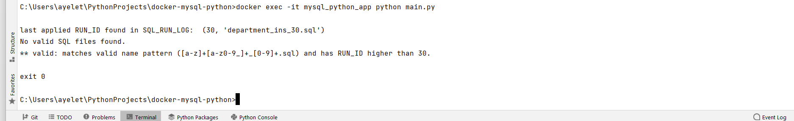

# docker-mysql-python
This is a python-mysql project based on docker cluster. The project has been created as a part of self-learning and practicing Docker principles.
The docker-compose.yml file configures two-container cluster as follows:
1. Mysql container. initialized with database MYSQL_DB and with creation of SQL log table SQL_RUN_LOG.
2. Applicative python container, includes the main program running the SQL files as well as Flask server code (app.py).
   The Flask app allows getting the run SQL related meta-data, as well as running some actions on the database, all via the provided API end points.

# OS
This docker cluster has been written and run on Windows 10.

# project's structure
app/  
  - main.py: main program; runs SQL files on the MYSQL database   
  - app.py: runs the Flask app  
  - database.py: contains the Database class with properties and methods run by the main.py script  
  - Dockerfile: builds the mysql_flask_app container  
  - requirements: contains list of Python required libraries  
  - templates/  
    - index.html (represents the HTML page shown in the Flask base URL http://localhost:5000) 

db/  
  - init.sql: initializes the mysql_db container by creating database 'mysql_db' and creating SQL_RUN_LOG table.  

sqls/   
  - sql_run_log_0.sql: in case table is dropped, this file creating it will be the first to run by main.py  
  - department_tab_10.sql: example file  
  - employee_tab_20.sql: example file  
  - department_ins_30.sql: example file  

docker-compose.yml: creates the docker cluster with the two containers  
  

# Python-Mysql development Platform
## Purpose
The project provides dev cluster allowing the user to run SQL scripts on the (Mysql) database and develop/test/run against it in Python environment.
The program registers each of the run SQL files in log table SQL_RUN_LOG.

## SQL scripts
1. Although the table created already in image, the script for creating log table SQL_RUN_LOG already provided under the 'sqls/' directory: sql_run_log_0.sql
   Do not change the RUN_ID (0) of script, it makes it the first to be run, before any other SQL file.
2. The SQL file names must comply with name convention [a-z]+[a-z0-9_]+_[0-9]+.sql, otherwise they are not recognized by the program as valid SQL files.
   Although table/object name is not enforced, it is recommended to create file names with the name of the object and its type.
   Example: employee_tab_10.sql
3. The file's extention (_<num>.sql) determines the order in which the files should be run.  
4. This number is referred to as the SQL RUN_ID and written as such in the SQL_RUN_LOG table.
5. Recommendation: create the SQL files with a gap of 10 between consecutive files. For example, department_tab_10.sql, employee_tab_20.sql etc; this
   will allow you flexibility in filling unnoticed DB data/objects gaps without having to change all scripts names if some scripts were forgotten.
6. The gaps between SQL RUN_IDs, though, must not exceed 10. For example, running department_tab_10.sql, employee_tab_21.sql with no SQL script with RUN_ID between 10 and 21,
   will issue an error.
7. Two SQL files cannot have the same RUN_ID. If found, an error will be issued.   

## Volumes defined in docker-compose.yml
1. Data consistency: volume data-volume:/var/lib/mysql is created to ensure data consistency, so even if the container is killed,  
   next time it is up the data previously created will be there.
2. Mapping SQL files path: volume ./sqls:/tmp/ is created to map the SQL files in local ./sqls directory to /tmp directory in the app container.  
   This means that the SQL files you put/add in ./sqls are seen transparently in container's path /tmp, which is the default path where  
   the program looks for SQL files to run.

## Setup and run the Docker cluster
(Docker-desktop installation assumed)
1. Clone this repository to your directory path on your OS. Project directory docker-mysql-python will be created.

2. Open a terminal window and go to local/path/to/docker-mysql-python
3. run docker-compose up

You should now see the cluster via your docker-desktop, as follows: 

## SQLs run flow
1. Docker container cluster must be up and running when running the SQL files.
When running Python script main.py, the run flow is as follows:
2. If table SQL_RUN_LOG does not exist, it will be created by running provided script sql_run_log_0.sql
3. A record with SQL file name, its RUN_ID, status (SUCCESS or FAILURE), error (in case of FAILURE) and date are written after the run of each SQL file.
4. SQL file is allowed to contain a few statements, but only one record will be written in log table SQL_RUN_LOG for it.   
5. The SQL files are run according to the last RUN_ID found in SQL_RUN_LOG table with status SUCCESS.
   example A: if scripts department_tab_10.sql, employee_tab_20.sql and department_tab_10.sql, employee_tab_20.sql passed successfully while 
   employee_ins_30.sql failed, the next time main.py will run, the first SQL file to run with be with the smallest RUN_ID that is greater than 20.
6. The main.py script will exit with error at the first FAILURE. Before exiting, a ROLLBACK will be executed for all file's statements.  
   Note: rollback can be applied only for DML statements.

## How to run the program
* From container (from /app): python main.py  
* From terminal: docker exec -ti mysql_flask_app python main.py  
* To run a specific SQL: docker exec -ti mysql_flask_app python main.py \<SQL file\>  
* To run SQLs from a directory: docker exec -ti mysql_flask_app python main.py \<path to SQLs directory\>
** Note: SQLs default path is /tmp  
   if running SQL/s from a different location in container, it must be specified.  
  
## Examples
### from container

### from terminal

### output when no files with RUN_ID higher than in SQL_RUN_LOG table found in sql files

## View Database on Mysql Client UI
For a better view of your DB tables and run status in SQL_RUN_LOG table, configure DB on one of the Mysql available UIs.
Example, MySql Workbench:
 
  
## SQL_RUN_LOG view

## Operations available via Flask URL End-Points
Recommended: use one of the available API platform on the internet to view/act on the available flask end-points as specified in the Flask base URL.  
Example: Postman  
You can view the available end-points on the base Flask URL, as follows:

## Examples
### Getting the data of all SQL files that ran successfully
  
* to get the data of the failed SQL files enter the "failed" end-point.
### Getting info of a specific SQL but its RUN_ID

### Drop tables and truncate SQL_RUN_LOG
You may want to run all SQL files from the scratch, and therefore drop all your app tables along with truncating the SQL_RUN_LOG table.  
You can achieve that by either:
1. Manually do that in the database itself (via the Mysql client or directly in the database)
2. Use the "drop_tables" API. In this case you must have file /sqls/drop_tables.sql (already provided with example tables) with the  
   relevant "drop table" statements (the "truncate" statement for the SQL_RUN_LOG already provided in file).  
   NOTE: to use the API you must set a header key first. In this project the value hasn't been encrypted.  
         set the key as follows under "Headers" configuration: key-name: Api-Key-Test, value: ayelet  
         If not confgured you'll get a "Not Authorized" response.  

